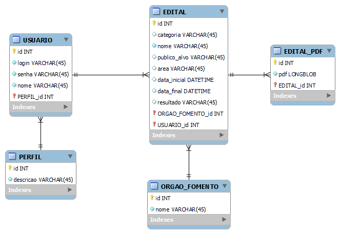

# ProjetoEditais - Back-End

Projeto a ser desenvolvido em Eng. de Software 2024.1

Envolvidos: Jean Araujo - DOUTORADO / RAFAEL ARAUJO - ESPECIAL / Felipe Pacheco - MESTRADO / Edjair Filho - MESTRADO / Arthur Miranda - GRADUAÇÃO / Mayanne Silva - GRADUAÇÃO / Maria Alves - GRADUAÇÃO

Ideias Iniciais:
Projeto visa a construção de uma plataforma com editais de invocação, ou seja, Editais publicos/privados disponibilizados/em fase de resultado disponiveis por orgãos de fomento de pesquisa/ICTs (exemplo: FACEPE, CNPQ, SECTI, ....) 

Plataforma WEB que seja possivel cadastrar Editais e Demonstrar esses editais:
  - Cadastro (inicialmente) manual:
      - PDF
      - NOME
      - Orgão de Fomento
      - Para quem? Qual area?
      - Data Inicio / Data Fim / Resultado
  - Gerenciamento Pós-Cadastro (UPDATE/DELETE)
  - Demonstração desses editais e dessas informações (Front-End):
      - Site
  - Editais (de forma inicial)
    - https://www.secti.pe.gov.br/editais/
    - https://www.facepe.br/editais/todos/
    - http://memoria2.cnpq.br/web/guest/chamadas-publicas
    - http://www.finep.gov.br/chamadas-publicas?situacao=aberta
   
Observações:
  - Tecnologias não definidas -> Projeto vai ser continuado por bastante tempo, procurar tecnologias solidas para o desenvolvimento
  - Necessario uma boa documentação do projeto
      - Descrever de forma clara (para um completo leigo) como executar esse projeto (de forma local), consequentemente (quando estiver aprovado) vamos disponibilizar online.
  - Ideias: https://ecossistema.pe/

-----------
### Procedimentos para executar o projeto local

Este projeto é uma API que visa atender o Dashboard de Editais. O seu desenvolvimento foi realizado utilizando as seguintes tecnologias:

- [Java 17](https://www.oracle.com/java/technologies/javase/jdk17-archive-downloads.html)
- [Spring Boot 3.3.0](https://spring.io/projects/spring-boot) 
- [Banco de dados H2 (Em memória para desenvolvimento)](https://www.h2database.com/html/main.html)
- [Banco de dados MySQL (Para produção)](https://dev.mysql.com/downloads/mysql/)

Para execução do projeto se faz necessário o download do Java 17, uma IDE como o [Intellij](https://www.jetbrains.com/idea/download/other.html), ou outra de sua preferência, e para execução em um banco de dados (Sem ser em memória) o MySQL.

A sua IDE deverá apontar para o Java 17 baixado, se a mesma já não o tiver de forma embutida.

No intellij o caminho é: Settings >> Build, Execution Deployment >> Compiler >> Java Compiler

Em seguida realizar o download do projeto **ProjetoEditaisBack** do GitHub, e importá-lo em sua IDE apontando para o arquivo **pom.xml**.

Após importar o projeto, aguarde as dependências serem baixadas, caso isso não ocorra, vá até a pasta do projeto por linha de comando e execute: **mvn clean install**.

Após estes procedimentos é só executar o projeto para iniciar a API.

No arquivo application.properties há a definição do provider apontando para o ambiente de desenvolvimento (dev) ou o ambiente de produção (prd), que está comentado(#):

spring.profiles.active=dev

#spring.profiles.active=prd

Ao executar para o ambiente de desenvolvimento é possível visualizar os dados do banco através da URL: http://localhost:8081/edital/h2/login

### API

Porta: 8081 \
Contexto: /edital \
Exemplo: http://localhost:8081/edital

Documentação: _HOST_/**swagger-ui/index.html** \
Exemplo: http://localhost:8081/edital/swagger-ui/index.html

[Endpoints (.json)](src/main/resources/collections_endpoints/UPE-Edital.postman_collection.json).

### Banco de dados

Nome do schema do banco de dados: **upe-edital**.

Diagrama Entidade Relacionamento

